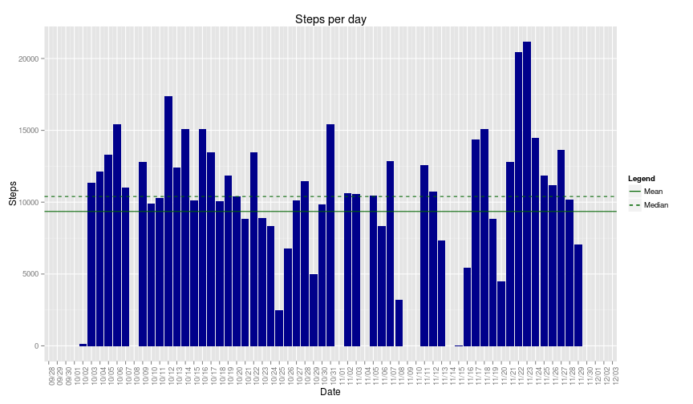
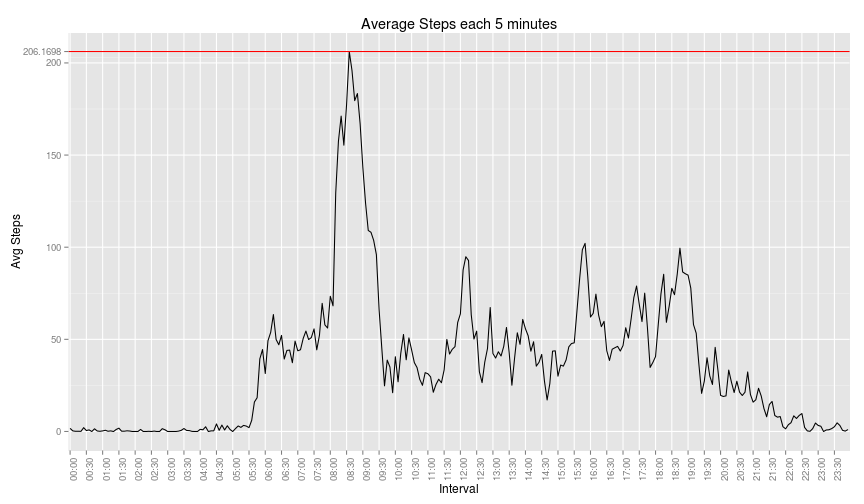

# Reproducible Research: Peer Assessment 1


## Loading and preprocessing the data
The following commands will unpack the csv from the zip file, read it into the 
`rawData` data frame and then generate a `processedData` data frame, which
contains the following fields:

- **steps**: Number of steps taking in a 5-minute interval (missing values are coded as `NA`)

- **intervStart**: Date and time (in `POSIXlt` format) of the day and start of 5-minute interval where the measurement was taken

- **intervEnd**: Date and time (in `POSIXlt` format) of the day and end of 5-minute interval where the measurement was taken. By definition is equal to `intervStart` plus 4 minutes and 59 seconds.

- **dateMeasured**: `Date` when the measurement was taken, makes some of the later processings easier.

- **rawInterv**: Formatted text string of the hour and minutes of the interval start, for labeling.


```r
rawData = read.csv(unz("activity.zip", "activity.csv"))
processedData = data.frame(steps = rawData$steps, intervStart = as.POSIXlt(sprintf("%s %d:%d", 
    rawData$date, rawData$interval%/%100, rawData$interval%%100), format = "%Y-%m-%d %H:%M"))
processedData$intervStart = as.POSIXlt(processedData$intervStart)
processedData$intervEnd = as.POSIXlt(processedData$intervStart + (60 * 4) + 
    59)
processedData$dateMeasured = as.Date(rawData$date)
processedData$rawInterv = sprintf("%02.0f:%02.0f", rawData$interval%/%100, rawData$interval%%100)
```


## What is mean total number of steps taken per day?
The following code calculates the total number of steps each day, discarding `NA`s and plots that in a histogram:

```r
require(plyr)
require(ggplot2)
require(scales)
stepsPerDay = ddply(processedData, .(dateMeasured), summarize, totalSteps = sum(steps, 
    na.rm = TRUE))
g = ggplot(stepsPerDay, aes(dateMeasured, totalSteps)) + geom_bar(stat = "identity", 
    fill = "dark blue") + xlab("Date") + ylab("Steps") + ggtitle("Steps per day") + 
    theme_classic() + theme(axis.text.x = element_text(angle = 90)) + scale_x_date(labels = date_format("%m/%d"), 
    breaks = date_breaks("1 day"))
plot(g)
```

 


The mean total number of steps taken per day is **9354.2295**.
The median total number of steps taken per day is **10395**.

## What is the average daily activity pattern?
The following code calculates and plots the average number of steps per 5-minute
interval across all days of the dataset. Missing data is discarded.

```r
stepsPerInterv = ddply(processedData, .(rawInterv), summarize, avgSteps = mean(steps, 
    na.rm = TRUE))
xLabels = stepsPerInterv$rawInterv[seq.int(1, 288, 6)]
g = ggplot(stepsPerInterv, aes(x = seq.int(1, 288), y = avgSteps)) + geom_line() + 
    xlab("Interval") + ylab("Avg Steps") + ggtitle("Average Steps each 5 minutes") + 
    theme_classic() + theme(axis.text.x = element_text(angle = 90)) + scale_x_discrete(breaks = seq.int(1, 
    288, 6), labels = xLabels) + scale_y_continuous(breaks = c(0, 50, 100, 150, 
    200, max(stepsPerInterv$avgSteps)), labels = c("0", "50", "100", "150", 
    "200", sprintf("%0.4f", max(stepsPerInterv$avgSteps)))) + geom_hline(yintercept = max(stepsPerInterv$avgSteps), 
    color = "red")
plot(g)
```

 


The 5-minute interval starting at **08:35** has
the maximum average number of steps, at **206.1698**.

## Imputing missing values
Need to impute the NAs for steps with something


## Are there differences in activity patterns between weekdays and weekends?
